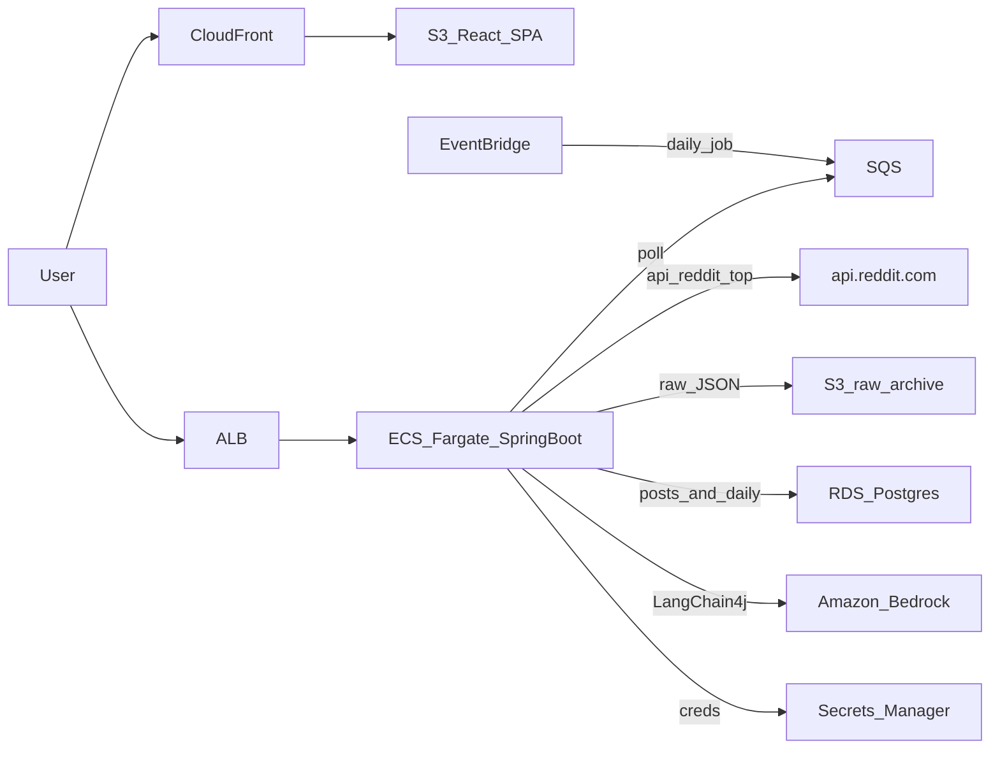

---

name: Daily Sentiment App
overview: Greenfield Spring Boot API + React UI on cheap production AWS (ECS, RDS, S3, SQS, CloudFront, EventBridge). Daily job fetches a subreddit’s top posts from api.reddit.com, LangChain4j/Bedrock scores each post, then rolls that up into a single “sentiment of the subreddit for the day.”
todos:

- id: scaffold content: Scaffold backend (Java 21 / Spring Boot out3 Maven), frontend (Vite React TS), docker-compose (Postgres + LocalStack), API Dockerfile status: pending
- id: domain-storage
content: "JPA entities/repos: subreddits, scrape_runs, posts (sentiment cols), daily_sentiments; S3 raw JSON writer"
status: pending
- id: reddit-client
content: "HTTP GET https://api.reddit.com/r/{sub}/top/?t=day&limit=10, parse listing JSON, User-Agent, 429 retries"
status: pending
- id: scrape-pipeline
content: SQS-triggered sequential daily orchestrator + EventBridge-compatible job messages (and UI enqueue)
status: pending
- id: sentiment
content: LangChain4j + Bedrock per-post scoring; weighted daily rollup + optional day summary; stub mode for local
status: pending
- id: rest-api
content: "REST + CORS: subreddits, scrapes, posts-by-day, daily sentiment history, health"
status: pending
- id: react-ui
content: Dashboard, top-posts, history pages; Vite proxy locally; VITE_API_BASE_URL for AWS
status: pending
- id: cdk-ecs
content: "Java CDK: public-subnet Fargate, ALB, RDS, S3 (raw+spa), CloudFront, SQS, EventBridge, Secrets, Bedrock IAM (no NAT)"
status: pending
- id: readme
content: "README: architecture, api.reddit.com listing, Bedrock access, local run, cheap AWS deploy"
status: pending
isProject: false

---


# Daily Subreddit Sentiment (Spring Boot + React + AWS)


## Product

Pick a subreddit → fetch **today’s top posts** via the public JSON listing `GET https://api.reddit.com/r/{sub}/top/?t=day&limit=10` → **LangChain4j on Amazon Bedrock** classifies each post → persist a **daily subreddit sentiment** (label, weighted score, short rationale) that the React UI shows as the day’s mood.

Example: `https://api.reddit.com/r/EngineeringResumes/top/?t=day&limit=10`

The official OAuth Data API is **not** used (it does not work for this project).

## Constraint (Reddit listing)

This client hits **unauthenticated** `api.reddit.com` JSON, not `oauth.reddit.com`. There is no OAuth client, no 100 QPM Data API contract, and Reddit may throttle or change the endpoint without notice.

- Unique `User-Agent` (browser-like or `ecs:reddit-sentiment:1.0`) and `Accept: application/json`.
- On `429` / empty/blocked HTML, wait and retry bounded times; process subreddits **sequentially**.
- Daily top listing is **1 call per subreddit per run** (`limit=10`).
- Bedrock calls do **not** go through Reddit.

## Architecture

One Spring Boot task on **ECS Fargate** (`desiredCount=1` so listing calls stay in-process and sequential). React is a static SPA on **S3 + CloudFront** (cheap, standard production split). EventBridge enqueues the daily job; SQS serializes work.




**AWS services (cheap production set):**

- **ECS Fargate** + **ECR** + **ALB** — API
- **S3** — React static site + raw Reddit JSON archive
- **CloudFront** — SPA CDN, HTTPS, cache (pennies at demo traffic)
- **EventBridge Scheduler** — once daily (plus “run now” from the UI)
- **SQS** — serialize scrape/score jobs, retries
- **RDS Postgres** (`db.t4g.micro`, single-AZ) — posts + daily sentiment
- **Amazon Bedrock** (Haiku-class) — sentiment via IAM, no API key
- **Secrets Manager** — DB password (no Reddit client id/secret)
- **CloudWatch Logs** — container logs
- **AWS CDK (Java)** — same language as the API

**Cost path:** public-subnet Fargate, **no NAT Gateway** (~$55–70/month idle in `us-east-1` without Free Trial). Private+NAT would add ~$33. Tear down when not demoing.

## Repo layout

```
backend/     Spring Boot 3.x / Java 21 (Maven)
frontend/    Vite + React + TypeScript
infra/       AWS CDK (Java)
docker-compose.yml   Postgres + LocalStack (S3 + SQS)
```

**Backend packages:** `config`, `reddit`, `scrape`, `sentiment`, `api`, `domain`

## Reddit client

- No OAuth, no token cache, no Reddit app
- Default fetch: `GET https://api.reddit.com/r/{subreddit}/top/?t=day&limit=10` (1 listing call per subreddit per job)
- Parse `data.children[].data` (`id`, `title`, `author`, `score`, `num_comments`, `created_utc`, `permalink`, `selftext`) into `posts` + S3 raw JSON
- No comment trees in v1

## Data model (Postgres)

- `subreddits` — name, enabled, last scraped
- `scrape_runs` — status, started/finished, posts upserted, api_calls, error
- `posts` — reddit id (unique), subreddit, title, author, score, num_comments, created_utc, permalink, selftext excerpt, `s3_key`, plus per-post sentiment columns (`label`, `score` -1..1, `rationale`, `model`, `scored_at`)
- `daily_sentiments` — `(subreddit, date)` unique: post_count, avg_score, **score-weighted** aggregate, overall `label`, optional 1–2 sentence `summary`, model, computed_at

S3 archive: `raw/subreddit={name}/dt={yyyy-MM-dd}/post={id}.json`

**Daily rollup:** classify each top post, then weighted-average by Reddit score (popular posts move the day’s mood). Optional second LangChain call: one short “today’s mood” summary from titles + labels. Cap Bedrock to sequential calls + a small limiter.

## Scheduling

- EventBridge **once per day** (e.g. 23:00 UTC) → one SQS message
- Worker loads **enabled** subreddits and processes them **sequentially**
- UI “Analyze today” enqueues the same SQS message (do not bypass the queue)
- SQS visibility timeout covers scrape + bounded sentiment batch; failures retry


## LangChain4j sentiment

Structured `AiServices` extractor (not free-text parsing), Bedrock Haiku-class, ECS task role `bedrock:InvokeModel`.

```java
interface SentimentExtractor {
  @UserMessage("""
    Classify sentiment of this Reddit post. Use only the given text.
    Title: {{title}}
    Body: {{body}}
    """)
  SentimentResult classify(@V("title") String title, @V("body") String body);
}

record SentimentResult(Label label, double score, String rationale) {}
enum Label { POSITIVE, NEGATIVE, NEUTRAL }
```

Local: real Bedrock via AWS profile, or `sentiment.stub=true` if model access is not enabled yet.

## REST API (consumed by React)

- `GET/POST /api/subreddits` — list / add / enable
- `POST /api/scrapes` — enqueue today’s top+score job
- `GET /api/scrapes` — run history
- `GET /api/posts?subreddit=&date=` — that day’s top posts + per-post sentiment
- `GET /api/sentiment/daily?subreddit=&from=&to=` — daily mood for charts/history
- `GET /actuator/health` — ALB health

CORS: `localhost:5173` locally; CloudFront origin in AWS. No auth in v1 (resume demo).

## React UI

Vite + React + TypeScript. Pages:

- **Dashboard** — select subreddit, show today’s label / weighted score / summary, “Analyze today” button
- **Top posts** — today’s posts with per-post sentiment
- **History** — daily scores over time (simple list or sparkline)

Local: Vite proxy `/api` → Spring Boot. AWS: CloudFront for static assets; API on ALB (env `VITE_API_BASE_URL`).

## Local vs AWS

- [docker-compose.yml](docker-compose.yml): Postgres + LocalStack (S3 + SQS)
- `application-local.yml` vs `application-aws.yml`
- Dockerfile for the Fargate API image; frontend `npm run build` uploaded to the SPA bucket
- CDK: VPC (public subnets, no NAT), ECS, ALB, RDS, two S3 buckets (raw + spa), CloudFront, SQS, EventBridge, Secrets, IAM including Bedrock invoke
- README: `api.reddit.com` listing URL, Bedrock model enablement, local run, cheap deploy notes


## Out of scope for v1

- Official Reddit OAuth Data API
- Comment-tree scraping
- Multi-task autoscaling of the worker
- API auth
- Terraform / OpenAI / Python LangChain
- NAT Gateway (unless you later want private subnets)


## Resume talking points

- Event-driven pipeline on ECS Fargate (EventBridge → SQS → worker) fetching public `api.reddit.com` top-of-day listings
- React SPA on S3/CloudFront + Spring Boot API; hot/cold storage (Postgres + S3 raw JSON)
- LangChain4j structured sentiment on Bedrock, rolled up to **daily subreddit mood**
